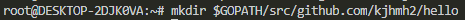

# 第三周作业

## 使用Go编程

17343037 海明皓

### 设置环境变量

GOPATH环境变量指定了工作空间的位置，我们首先需要建立一个工作空间目录，并设置相应的GOPATH：


并将工作空间的bin子目录添加到PATH中：


### 包路径

我们使用 `github.com/user` 作为基本路径。在工作空间里创建一个目录，
我们将源码存放到其中：


### 第一个程序

要编译并运行简单的程序，我们首先要选择包路径（我们在这里使用
`github.com/user/hello`），并在工作空间内创建相应的包目录：



然后我们在该目录中创建名为`hello.go`的文件，内容如下：


然后我们就能够使用go工具构建并安装这个程序：


现在我们就能够再命令行下输入其完整路径来运行了：


由于我们已经将 `$GOPATH/bin` 添加到 `PATH` 中了，所以只需输入该二进制文件名即可：


### 编写第一个库

现在我们编写一个库，并让 `hello` 程序来使用它：

同样，第一步还是选择包路径（我们将使用 `github.com/user/stringutil`）
并创建包目录：


接着，在该目录中创建名为`reverse.go`的文件，内容为一个字符串反转的函数：


现在用`go build`命令来测试该包的编译：


然后我们对原来的`hello.go`文件进行修改：


由于无论是安装包还是二进制文件，`go` 工具都会安装它所依赖的任何东西。所以我们输入如下命令：


来安装 `hello` 程序时，`stringutil` 包也会被自动安装。

运行此程序，我们可以得到：


最后我们还要使用`go install`命令将包的对象放到工作空间的 `pkg` 目录中，得到如下的路径：


```
bin/
	hello                 # 可执行命令
pkg/
	linux_amd64/          # 这里会反映出你的操作系统和架构
		github.com/user/
			stringutil.a  # 包对象
src/
	github.com/user/
		hello/
			hello.go      # 命令源码
		stringutil/
			reverse.go       # 包源码
```

### 测试

我们可通过创建文件 `$GOPATH/src/github.com/user/stringutil/reverse_test.go`
来为 `stringutil` 添加测试，其内容如下


然后我们利用 `go test` 运行该测试：


### 远程包

我们可根据导入路径的描述来获取包源代码。`go`工具可通过此特性来从远程代码库自动获取包。例如我们执行：


然后我们同样执行`go install`命令，得到如下的工作目录：

```
bin/
	hello                 # 可执行命令
pkg/
	linux_amd64/
		code.google.com/p/go.example/
			stringutil.a     # 包对象
		github.com/user/
			stringutil.a     # 包对象
src/
	code.google.com/p/go.example/
		hello/
			hello.go      # 命令源码
		stringutil/
			reverse.go       # 包源码
			reverse_test.go  # 测试源码
	github.com/user/
		hello/
			hello.go      # 命令源码
		stringutil/
			reverse.go       # 包源码
			reverse_test.go  # 测试源码
```

## 快速排序测试

我们按照快速排序的定义，写出对应的`Go`程序：


为其添加一个测试函数：


得到的测试结果：


